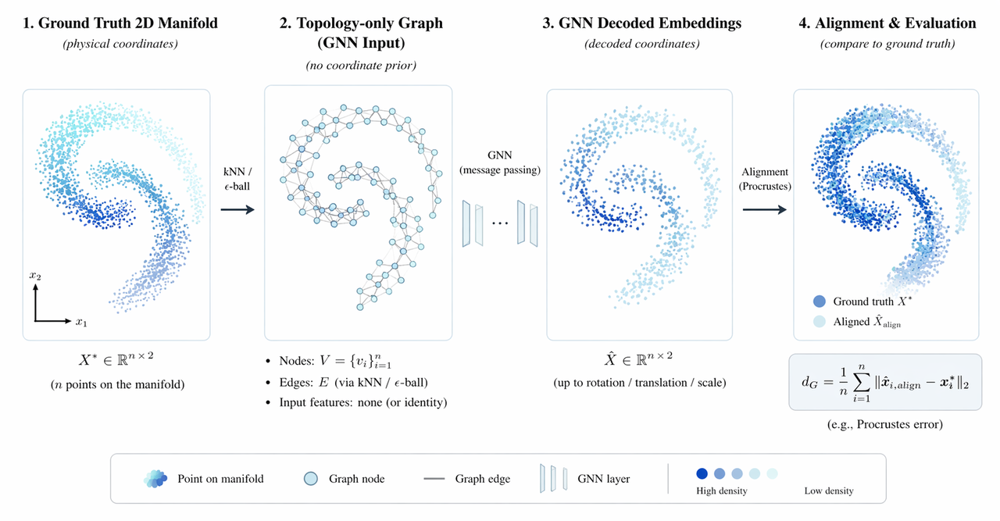

# GraphDecoding

[](https://arxiv.org/abs/2301.10956)

Extended implementation of [Graph Neural Networks can Recover the Hidden Features Solely from the Graph Structure](https://arxiv.org/abs/2301.10956) (ICML 2023) by Ryoma Sato.

---

## Method

**Core Problem**: Given a graph structure (nodes + edge connectivity), can we recover the hidden geometric features of nodes?

**SimpleScale Approach**:
1. **Input**: Random/trivial node features + structural descriptors (PageRank, degree, clustering coefficient, etc.)
2. **Architecture**: GraphSAGE-based message passing with density-aware scaling
3. **Objective**: Reconstruct hidden geometry/manifold from pure graph structure



---

## Experiments

### Experiment 1: KNN vs E-ball Comparison

Compare SimpleScale with different neighborhood construction methods (KNN and e-ball).

```bash
# Single dataset
python src/main.py --dataset moon --K 900

# Full experiment suite
bash run_knn_eball.sh
```

**Results** (lower dG is better):

| Dataset | KNN Avg degree | e-ball Avg degree | KNN (dG) | e-ball (dG) | Best |
|---------|----------------|-------------------|----------|-------------|------|
| moon | 1005 | 999 | 0.0864 | 0.0051 | e-ball |
| circles | 1090 | 1067 | 0.5997 | 0.0735 | e-ball |
| spiral | 1041 | 1023.8 | 97.2098 | 1.3757 | e-ball |
| swissroll2d | 753 | 755 | 0.5416 | 0.3908 | e-ball |
| scurve2d | 781 | 774 | 0.0351 | 0.0562 | KNN |
| clusters | 882 | 890 | 1.5990 | 6.5253 | KNN |
| grid | 1502 | 1506 | 0.0623 | 0.0964 | e-ball |
| ring | 744 | 743 | 0.0110 | 0.0189 | KNN |
| line | 1195 | 1204 | 0.0878 | 0.0105 | e-ball |
| wave | 699 | 702 | 11.8006 | 0.3658 | e-ball |

### Experiment 2: GNN Architecture Comparison

Compare different GNN architectures (Proposed, GIN, GAT) for hidden feature recovery.

```bash
cd gnnrecover
bash run_gnn.sh
```

---

## Quick Start

```bash
cd GraphDecoding

# Setup environment
uv venv --python 3.12
uv pip install -r requirements.txt
source .venv/bin/activate

# Run experiments
bash run_knn_eball.sh          # KNN vs e-ball comparison
cd gnnrecover && bash run_gnn.sh  # GNN architecture comparison
```

---

## Structure

```
GraphDecoding/
├── configs/default.yaml      # Config file
├── src/
│   ├── main.py               # SimpleScale (KNN/e-ball) entry point
│   └── utils/                # Utilities
├── gnnrecover/
│   ├── main_all_dataset_gnn.py  # GNN comparison entry point
│   ├── run_gnn.sh               # GNN experiment runner
│   └── utils.py
├── outputs/                   # Experiment outputs
├── requirements.txt
└── README.md
```

---

## Citation

```bibtex
@inproceedings{sato2023graph,
  author    = {Ryoma Sato},
  title     = {Graph Neural Networks can Recover the Hidden Features Solely from the Graph Structure},
  booktitle = {International Conference on Machine Learning, {ICML}},
  year      = {2023},
}
```
