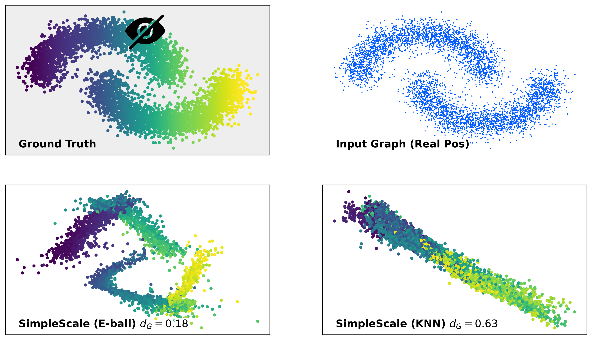

# Graph Neural Networks can Recover the Hidden Features Solely from the Graph Structure (ICML 2023)

[](https://arxiv.org/abs/2301.10956)

We proved that GNNs can create completely new and useful node features even when the input node fatures are uninformative, by absorbing information from the graph structure.

Paper: https://arxiv.org/abs/2301.10956

## 🚀 SimpleScale

**SimpleScale** is the core model implemented in this project. It is designed to verify that GNNs can recover hidden node features solely from graph structure.



*   **Input**: It takes trivial or random features combined with structural descriptors (e.g., PageRank, Degree, Clustering Coefficient).
*   **Architecture**: It utilizes a simplified GraphSAGE backbone to aggregate local structural information.
*   **Objective**: It optimizes the alignment between the reconstructed geometry and the underlying manifold, effectively "decoding" the graph.

The scripts `semi_moon.py` and others use `GraphSAGE_SimpleScale` to demonstrate this capability on various datasets.

## 💿 Dependency

Please install dependencies by `pip install -r requirements.txt`.

[PyTorch](https://pytorch.org/) may not be installed due to GPU issues. Then please install it from the [official website](https://pytorch.org/) (e.g., by cpuonly flag).

## 📂 Files

* `shortest_path_plot.py` reproduces Figure 2.
* `semi_moon.py` reproduces the upper panel of Figure 3.
* `semi_adult.py` reproduces the lower panel of Figure 3.
* `ind_moon.py` reproduces Figure 4.
* `accuracy_of_recovered_features.py` reproduces Table 1.

## 🗃️ Download Dataset

Please run the following command in the root directory before the execution of `semi_adult.py`.

```
$ wget https://archive.ics.uci.edu/ml/machine-learning-databases/adult/adult.data
```

## 🧪 Evaluation

Reproduce the results by the following commands.

```
$ python semi_moon.py
```

The results are saved in `imgs` directiory.

## 🖋️ Citation

```
@inproceedings{sato2023graph,
  author    = {Ryoma Sato},
  title     = {Graph Neural Networks can Recover the Hidden Features Solely from the Graph Structure},
  booktitle = {International Conference on Machine Learning, {ICML}},
  year      = {2023},
}
```
